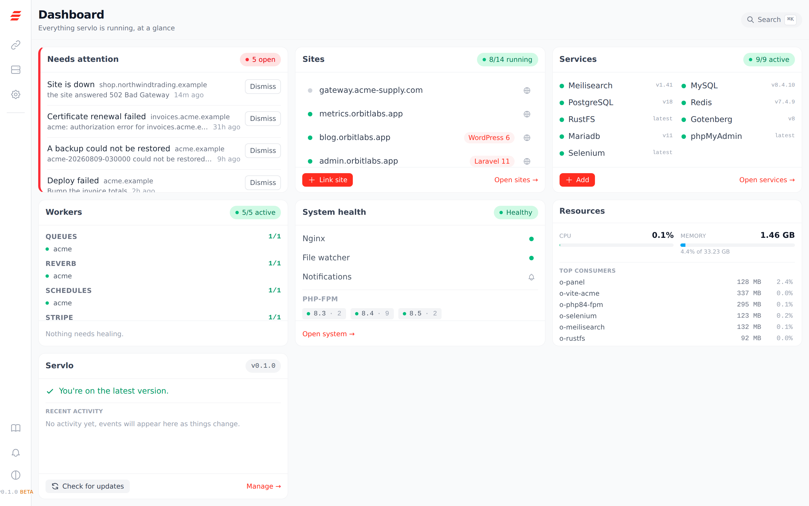

<p align="center">
  <a href="https://servloofficial.github.io/servlo">
    
  </a>
</p>

<p align="center">
THE FREE, SELF-HOSTED CONTROL PANEL FOR PRODUCTION PHP SERVERS
</p>

<p align="center">
  <picture>
    <source media="(prefers-color-scheme: dark)" srcset="docs/public/assets/hero-dark.png">
    
  </picture>
</p>

<p align="center">
  <a href="LICENSE"></a>
  
  
  
</p>

---

Point a droplet at Servlo and run your PHP sites from a browser. Add a site from
a ZIP, a Git clone, a folder you already have, or a one-click app. Give it a
domain, click **Get SSL**, and deploy it. Toggle MySQL or Redis on. Sleep,
because the backups are tested by restoring them rather than assumed.

It is the cPanel and Forge niche, except it runs on **your** server, costs
nothing, has no paid tier, and phones home to nobody.

## Install

```bash
curl -fsSL https://raw.githubusercontent.com/ServloOfficial/servlo/main/install.sh | bash
```

Anything needing root is printed for you to run. Servlo never calls `sudo`
itself, and it never disables your SSH password login to "help".

Then, from the panel or the terminal:

```bash
servlo apps install wordpress --domain blog.example.com   # site, database, admin account
servlo secure blog.example.com                            # Let's Encrypt, once DNS points here
servlo backup blog.example.com                            # encrypted, files and database
servlo backup verify --latest blog.example.com            # restore it and prove it works
servlo doctor                                             # is this machine actually healthy
```

<h3 align="center">
  <a href="https://servloofficial.github.io/servlo">Documentation</a>
</h3>

## What it does

**Sites.** From a folder, a ZIP, a Git clone, or one click for WordPress, Joomla
and Grav. Its own PHP version and FPM pool per site. Aliases, www redirects,
subdomains as first-class sites, staging copies that are password-protected and
noindexed, and an importer for a site living somewhere else right now.

**Certificates.** Let's Encrypt over HTTP-01, or DNS-01 for wildcards through
Cloudflare, Route53 and DigitalOcean. **Get SSL** refuses to fire until a live
lookup shows every domain pointing here, and tells you what it can see while you
wait. A renewal that fails is a banner and an email, never a silent expiry.

**Deploys.** `git pull` plus a script you can edit, pre-filled for your
framework. A database backup is taken automatically before anything that
migrates. WordPress deploys leave `uploads` and `plugins` alone, because losing a
client's media is not a thing that should be possible. Deploy history, redeploy
the previous commit, and signed Git webhooks when you want them.

**Backups you can trust.** Encrypted, scheduled, kept on daily/weekly/monthly
retention, pushed to S3-compatible storage or SFTP. Then **restored into a
scratch database on a schedule to prove they still work** — an untested backup is
a rumour. Plus a state archive that turns a fresh droplet back into this one.

**Operations.** One list of the six things that actually go wrong, per-site
uptime checks, log rotation, a hardening audit, ufw and fail2ban, SSH key
management, a file manager and SFTP scoped to a single site.

**A panel you can put on the internet.** Argon2id, CSRF everywhere, rate
limiting with lockout, optional two-factor, Admin and Developer roles enforced on
every route *and* every WebSocket message, and an append-only audit log of who
did what.

Under it all: rootless Podman, systemd, no Docker daemon, and no permanent root
process.

## Status

**v0.1.0 — beta, and honest about it.** Everything described above is built and
tested. What has not happened yet is a full run on a real droplet, so please do
not put a client on this today.

The test suite and the UI checks are green, but they run in a container, and a
container cannot prove that Let's Encrypt issues a certificate, that a backup
lands in your bucket, or that every site comes back after a reboot. That pass is
next, and [`HANDOVER.md`](HANDOVER.md) is the checklist.

## What it is not

**Not multi-tenant hosting.** Every site runs as the same Linux user. A
compromised site can read every other site's `.env` on that machine. Per-site
database users with scoped grants limit the damage, but do not put a site you do
not control next to one that matters.

**Not a mail server**, and never will be. SMTP settings per site and for the
panel, and that is the whole story.

## Requirements

Ubuntu 24.04 LTS, Podman 4.5+, 2GB RAM or more. The installer checks all three
and stops rather than half-installing on anything else.

## A fork of Lerd

Servlo is a fork of [Lerd](https://github.com/lerd-env/lerd), an MIT-licensed
local PHP development environment, whose engine already did the hard parts:
multiple PHP versions side by side, validated nginx vhosts per site, one-click
services from a YAML store, supervised workers, certificates, live logs and a
Svelte dashboard, all rootless.

Lerd aims that at `.test` domains on a laptop. Servlo aims it at a server. The
local-development features with no production meaning, and the handful that
amount to remote code execution on a public box, were deleted rather than
disabled, and a scan fails the build if any of them ever comes back.

The upstream MIT notice is kept in [LICENSE](LICENSE).

## Contributing

Issues and pull requests welcome. Read [`CLAUDE.md`](CLAUDE.md) first for the two
rules that matter: behaviour belongs in the YAML stores, not in Go, and no Go
code may know a framework's name. Adding a framework, a service or a
one-click app is a YAML change, not a release.

Found a security problem? [`SECURITY.md`](SECURITY.md).

## Licence

MIT. See [LICENSE](LICENSE).

<p align="center"> <b>Made with ❤️ from Pakistan</b> </p>
